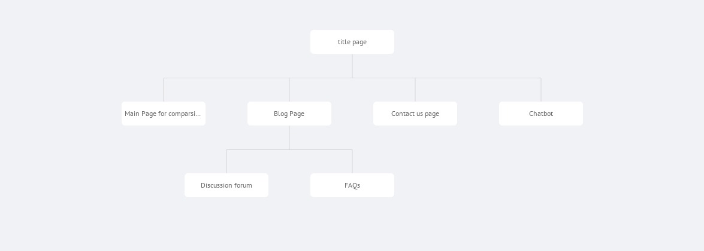

# Grocery App
This project is a web app that is created to provide users with the ease of comparing the pricing and ratings of a particular grocery product available on all different e-commerce websites at a single place.

# Vision
Grocery App will basically collect all the data related to a particular product from all the websites and will make a comparison between some important aspects such as pricing and ratings on all the websites for it. This will the help the user to choose the best for him without wandering on a number of websites or doing any research. It will save time, energy and one can make a cost effective purchase.

# Objective
This website will compare a product on different website and will help him make a better choice.

# Table of contents
- Tools
- Installation
- Folder structure
- Project Plan
- Contributing
- Project Admins
- Maintainer
- Code of conduct
- License

# Tools
- HTML
- CSS
- JavaScript
- React
- Nodejs

# Folder Structure

# SITE MAP

# Contributing to Grocery App
To contribute to <project_name>, follow these steps:

1. Fork this repository.
2. Create a branch: git checkout -b <branch_name>.
3. Make your changes and commit them: git commit -m '<commit_message>'
4. Push to the original branch: git push origin <project_name>/
5. Create the pull request. Alternatively see the GitHub documentation on [creating a pull request](https://docs.github.com/en/free-pro-team@latest/github/collaborating-with-issues-and-pull-requests/creating-a-pull-request).

# Project Admins
[Devanshi Katyal](https://github.com/devanshi-katyal)
[Mansi Sharma](https://github.com/mansi35)
# Maintainer
[DSC-IGDTUW](https://github.com/dscigdtuw)

# Code of Conduct :

# LICENSE :
